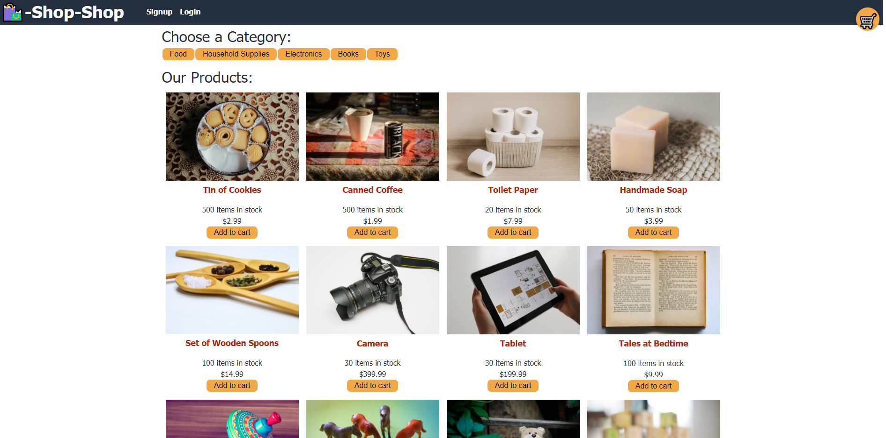

# shop shop with redux

## Description

A sample e-commerce website that showcases key features that are involved with online stores. Sort your products with our handy dandy categories feature. Add products to your cart, andfind your cart even if you leave temporarily. Checkout sample provided by stripe! Finally, all of these features are managed by Redux!
## Table of Contents
* [Installation](#installation)
* [License](#license)
* [Questions](#questions)
## Installation
Simply navigate to the website below!

https://still-badlands-04219.herokuapp.com/ 
## License
This project is covered under the MIT license.
[Click here to see the terms of the license](https://choosealicense.com/licenses/mit/)
## Questions
Any questions or concerns?
Contact me on my github: [blazelim](https://github.com/blazelim/)

Or email me at: blazebentleycolim@gmail.com